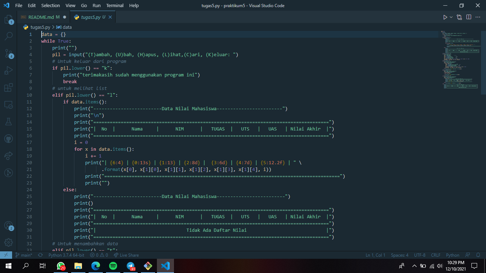
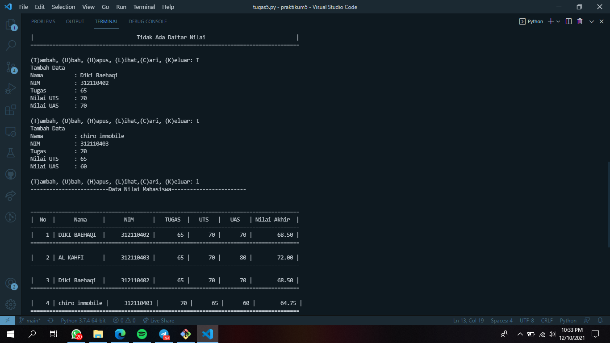
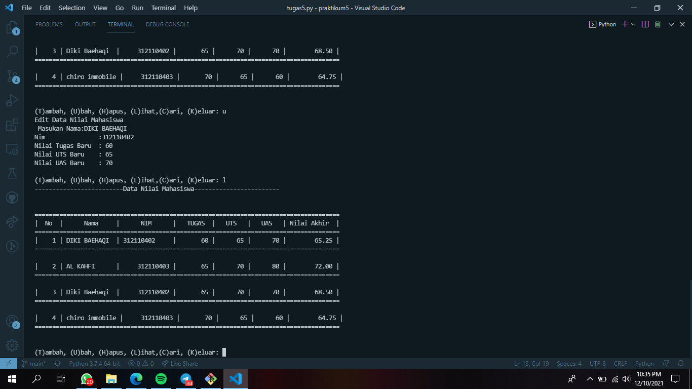
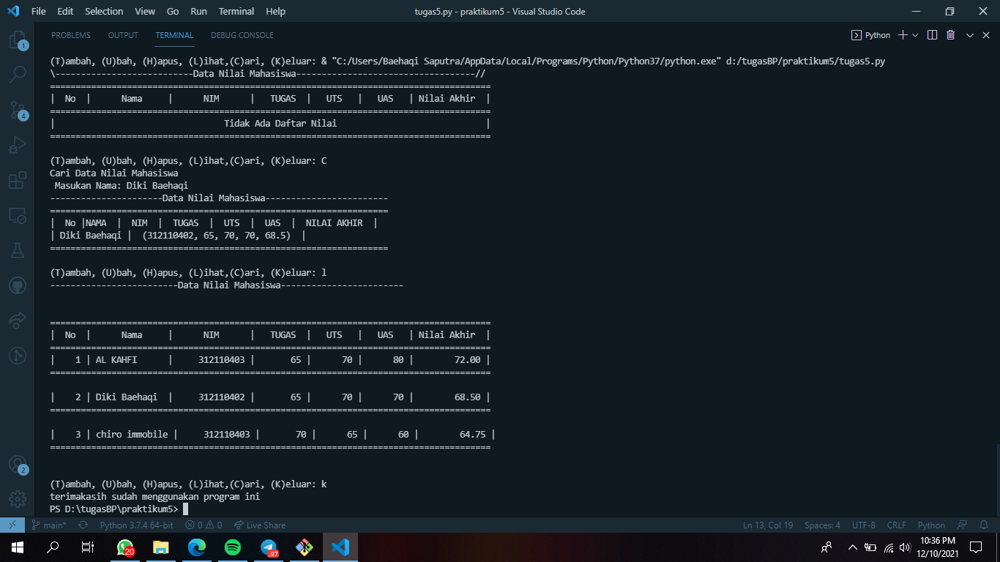
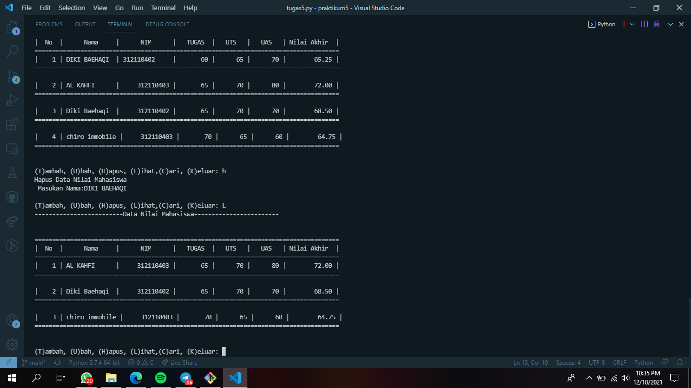

# praktikum5

## Input data mahasiswa menggunakan bahasa python

### flowchart dari input data mahasiswa
Membuat Program Sederhana Menampilkan Daftar Nilai Mahasiswa Dengan Ketentuan Sebagai Berikut :
Program dibuat dengan dictionary
menampilkan menu pilihan:
Tambah data
Ubah Data
Hapus Data
Cari Data
Tampilkan Data

### source code program python menggunakan dictionary

### menu tambah data

### menu ubah data

### menu cari data

### menu hapus data

TERIMAKASIH
